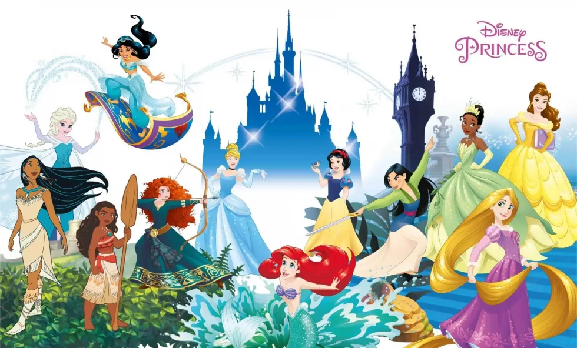
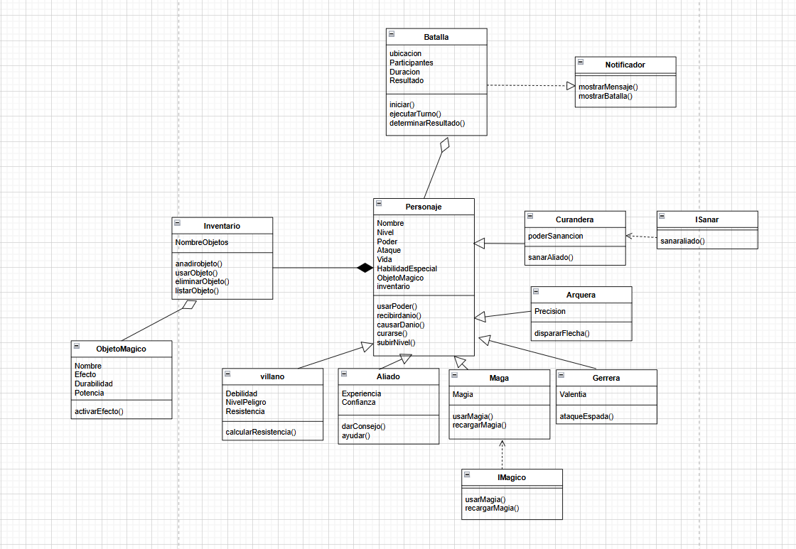

# 👑✨ Disney Princess Battle Arena ✨👑



## 🎯 Objetivo General
Desarrollar una **aplicación de consola interactiva** que simule batallas entre princesas Disney con distintas clases (Guerrera, Maga, Arquera, Curandera.), aplicando **programación orientada a objetos**, principios **SOLID**, y diseño limpio.

---

## ⚔️ Funcionalidades principales
- **Gestión de personajes 👸**
  - Crear princesas de diferentes clases (Guerrera, Maga, Arquera, Curandera).
  - Cada princesa tiene atributos y habilidades especiales únicas.
  - Subida de nivel con mejoras de estadísticas.

- **Sistema de batallas 🏰**
  - Simulación de batallas por turnos entre princesas y enemigos.
  - Uso de habilidades especiales con efectos distintos.
  - Resultados mostrados por consola con mensajes estilizados.

- **Inventario y objetos 🪄**
  - Manejo de objetos mágicos: copo de nieve, espada ancestral, arco y flecha, flor de loto, bastón mágico, vara de la serpiente.
  - Los objetos modifican atributos o comportamientos de las princesas.


- **Menú funcional 🌟**
  - Uso de **inquirer** para navegar opciones:
    👑 Bienvenida al Reino Disney 👑
    1. Crear Personaje 🎀
    2. Ver Personaje 🌸
    3. Iniciar Batalla ⚔️
    4. Salir 🏰

---

## 🛠️ Aspectos Técnicos
- **Lenguaje:** JavaScript con Node.js
- **Librerías permitidas:** `inquirer`, `chalk`, `uuid`, etc.
- **Programación Orientada a Objetos:**
  - Herencia, polimorfismo, encapsulamiento y composición.
- **Principios SOLID:**
  - **SRP:** Clases con única responsabilidad (GestorBatalla, GestorInventario, Notificador).
  - **OCP:** Nuevas clases de princesa pueden añadirse sin modificar las existentes.
  - **LSP:** Todas las princesas heredan de la clase base `Personaje`.
  - **ISP:** Interfaces como `ISanar`, `IMagico`.-
  - **DIP:** El gestor de batalla depende de abstracciones, no de implementaciones concretas.

---

## 📖 Ejemplo de Princesas
- **Guerrera (Mulán 🗡️)** → Alta fuerza, precisión y puntería.
- **Maga (Elsa ❄️)** → Ataques de hielo y congelamiento.
- **Arquera (Mérida 🏹)** → Precisión y daño a distancia.
- **Curandera (Rapunzel 🌸)** → Sanación.

---

## 🎮 Ejecución del Proyecto
1. Clonar el repositorio
   ```bash
   git clone https://github.com/usuario/disney-princess-battle.git
   ```
2. Instalar dependencias
   ```bash
   npm install
   ```
3. Ejecutar la aplicación
   ```bash
   node src/index.js
   ```

---

## 📌 Diagrama UML
**

---

## ✨ Créditos
👑 Proyecto realizado por Valentina y Camila  
🌟 Inspirado en el mundo mágico de las Princesas Disney  
💻 Aplicando SOLID, OOP y Node.js

## 📩 Contacto GitHub
- https://github.com/ValentinaDelgadoRincon
- https://github.com/CamilaFlorez12 